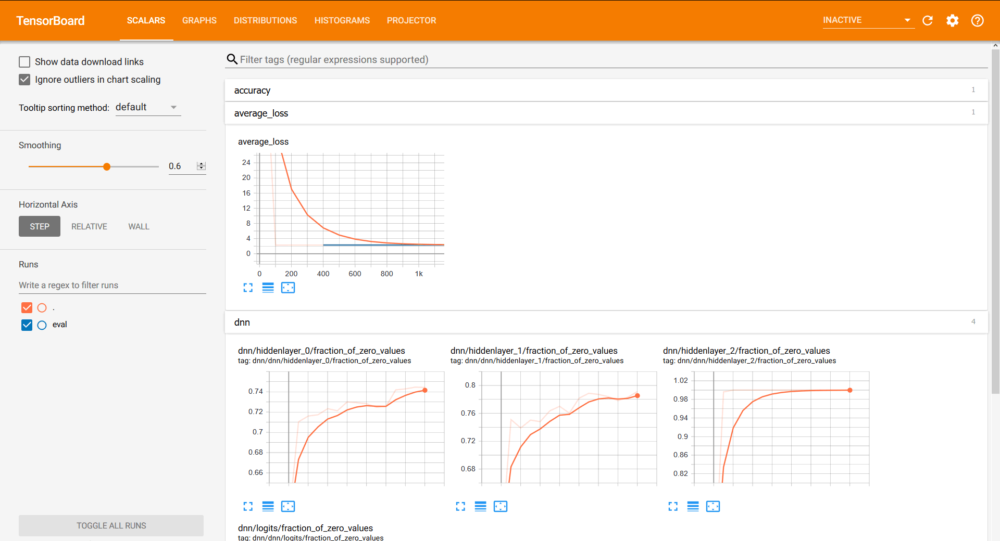

# Data Science Process in the Google Cloud

The presentation were created in the scope of a project on tensorflow and Google Cloud Platform together with [Fabien Tarrade](https://twitter.com/fabtar), please visit [github/tarrade/proj_DL_models_and_pipelines_with_GCP](https://github.com/tarrade/proj_DL_models_and_pipelines_with_GCP/) for latest developments.

Slides for 
   - [Windows Users](https://enryh.github.io/gcp_ml_engine_talk/ml_engine_presentation_win.slides.html#/), underlying [notebook](https://github.com/enryH/gcp_ml_engine_talk/blob/master/notebook/ml_engine_presentation_win.ipynb)  (in [nbviewer](https://nbviewer.jupyter.org/github/enryH/gcp_ml_engine_talk/blob/master/notebook/ml_engine_presentation_win.ipynb))
   - [Linux/Mac Users](https://enryh.github.io/gcp_ml_engine_talk/ml_engine_presentation_bash.slides.html#/), view underlying [notebook](https://github.com/enryH/gcp_ml_engine_talk/blob/master/notebook/ml_engine_presentation_bash.ipynb) (in [nbviewer](https://nbviewer.jupyter.org/github/enryH/gcp_ml_engine_talk/blob/master/notebook/ml_engine_presentation_bash.ipynb))


Follow me on [](https://twitter.com/Henrywebel).

## Setup to execute presentation notebooks
### Fresh installation Anaconda
Install [Anaconda Distribution](https://www.anaconda.com/distribution/) on your system. This provides you with the most important packages
on your system.


Install [Jupter Notebook extension](https://jupyter-contrib-nbextensions.readthedocs.io/en/latest/install.html) into base environment.

```bash
conda activate base
conda install -c conda-forge jupyter_contrib_nbextensions #triggers system-wide installation
```


## Download the code from GitHub
- go to the directory in which you want to download the package from git  
- download the package from Github:   
  - ```git clone https://github.com/enryH/gcp_ml_engine_talk/```
  - or download [zipped repository](https://github.com/enryH/gcp_ml_engine_talk/archive/dev.zip).
- open a command line in the directory that contains the code from GitHub.

### Create the python conda env  
This will provide you a virtual environment of python packages needed to run the code.

- create a python env based on a list of packages from environment.yml    
  ```conda env create -f environment.yml -n gcp_dl```
  
 - activate the env  
  ```conda activate gcp_dl```
  
  > In case of issue clean all the cache in conda
  > ```conda clean -a```

- In case you want to use [nbdime](https://nbdime.readthedocs.io/en/latest/) for checking differences in notebooks:

  ```
  nbdime config-git --enable --global
  ```

- In case you want to use interactive slides using [RISE](https://rise.readthedocs.io/en/5.4.1/installation.html):

  ```
  conda activate gcp_dl
  conda install -c conda_forge rise
  ```

### Update or delete the python conda env 
- update a python env based on a list of packages from environment.yml  
  ```conda env update -f environment.yml -n gcp_dl```

- delete the env to recreate it when too many changes are done  
  ```conda env remove -n gcp_dl```

## TensorBoard
- open a command line
- go to the directory in which you want to download the package from git  
- activate the env:   
  ```conda activate gcp_dl```
- execute TensorBoard:   
  ```tensorboard --logdir ./results```
- open a web browser (Firefox) and copy the link that appear in the prompt above:    
  ```http://<something>:6006```
 
  
   
