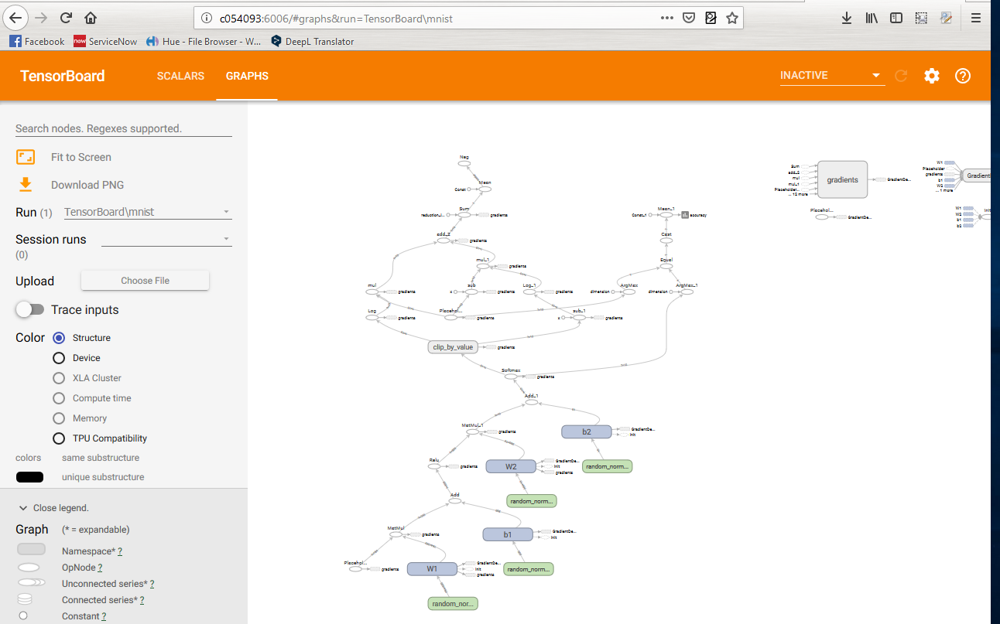
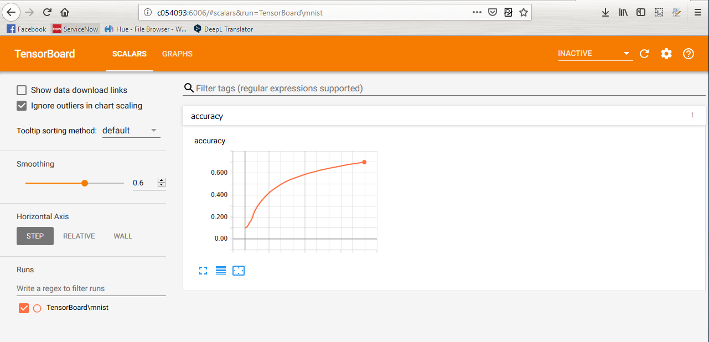

# Develop DL models using Tensorflow and pipelines for industrialization and model serving


## Fresh installation Anaconda
Install [Anaconda Distribution](https://www.anaconda.com/distribution/) on your system. This provides you with the most important packages
on your system.


Install [Jupter Notebook extension](https://jupyter-contrib-nbextensions.readthedocs.io/en/latest/install.html) into base environment.

```bash
conda activate base
conda install -c conda-forge jupyter_contrib_nbextensions #triggers system-wide installation
```

## Download the code from GitHub
- go to the directory in which you want to download the package from git  
- download the package from Github:   
  - ```git clone https://github.com/tarrade/proj_DL_models_and_pipelines_with_GCP.git```
  - or with other method from your choice (web interface, zip ...)   
- open an "Anaconda prompt" in the directory that contain the code from GitHub:   
  ```your_dir/proj_DL_models_and_pipelines_with_GCP/```

### Create the python conda env  
This will provide you a unique list of python packages needed to run the code.
It seems 1.12 is causing trouble on  a Mac, use 1.11 instead

- create a python env based on a list of packages from environment.yml    
  ```conda env create -f environment.yml -n gcp_dl```
  
 - activate the env  
  ```conda activate gcp_dl```
  
  > In case of issue clean all the cache in conda
  > ```conda clean -a```

- In case you want to use interactive slides using [RISE](https://rise.readthedocs.io/en/5.4.1/installation.html):

  ```
  conda activate gcp_dl
  conda install -c damianavila82 rise
  ```

### Update or delete the python conda env 
- update a python env based on a list of packages from environment.yml  
  ```conda env update -f environment.yml -n gcp_dl```

- delete the env to recreate it when too many changes are done  
  ```conda env remove -n gcp_dl```

### TensorBoard
- open a anaconda prompt
- go to the directory in which you want to download the package from git  
- activate the env:   
  ```conda activate gcp_dl```
- execute TensorBoard:   
  ```tensorboard --logdir ./results```
- open a web browser (Firefox) and copy the link that appear in the prompt above:    
  ```http://<something>:6006```
 
  
   
 


# Slides on GCP ML-Engine
